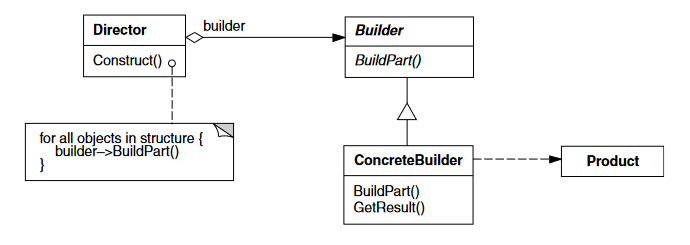

## :bulb: Sobre

O objetivo desse projeto é implementar o padrão de projeto criacional builder
com o objetivo de praticar o conteúdo estudado. Portanto, não foi implementado 
nenhum padrão arquitetural que deixaria o projeto complexo sem necessidade 
(KEEP IT SIMPLE STUPID!).

Nesse exemplo, o padrão builder foi utilizado para implementar um leitor da classe Report
para tipos diversos sem mudar a implementação da classe leitora denominada ReportReader.
A implementação conta com os seguintes participantes:

* Builder(IReportBuilder):
  * especifica uma interface abstrata para criação de partes de um 
  objeto-produto.
* ConcreteBuilder (HtmlReportBuilder, PdfReportBuilder):
  * constrói e monta partes do produto pela implementação da interface de
    Builder;
  * define e mantém a representação que cria;
  * fornece uma interface para recuperação do produto (por exemplo, GetHtml, GetPdf).
* Director (ReportReader)
  *  constrói um objeto usando a interface de Builder.
* Product
  * representa o objeto complexo em construção. ConcreteBuilder constrói a
    representação interna do produto e define o processo pelo qual ele é
    montado;
  * inclui classes que definem as partes constituintes, inclusive as interfaces
    para a montagem das partes no resultado final.

## :mag_right: Endpoints

* **/html-converter**: Recebe um json de Report e retorna um html com a página formada.
* **/pdf-converter**: Recebe um json de Report e retorna um arquivo pdf.

## :computer: Execução

O projeto é compatível com Docker, portanto basta montar e executar o container que não devem haver problemas.

## :book: Referências

### Livros

- [Padrões de projeto: soluções reutilizáveis de software orientado a objetos - Erich Gamma ... [et al.] (2007)](https://github.com/ropalma/ICMC-USP/blob/master/Book%20-%20Padr%C3%B5es%20de%20Projeto%20-%20Soluc%C3%B5es%20Reutiliz%C3%A1veis%20de%20Software%20Orientado%20a%20Objetos.pdf)